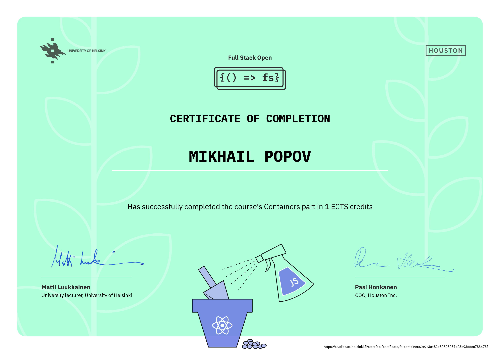

# Full Stack Open 2022 Part 12
This repository contains exercise submissions for [part 12](https://fullstackopen.com/en/part12) of [fullstackopen.com](https://fullstackopen.com/) course by the [University of Helsinki](https://www.helsinki.fi/).

## Other parts
Links to submission repositories of the other parts of the course:

- [Parts 0-9](https://github.com/cmd-mish/fullstackopen)
- [Part 11. CI/CD](https://github.com/cmd-mish/fullstackopen-part11)
- [Part 13. Using relational databases](https://github.com/cmd-mish/fullstackopen-part13)

## Certificate
